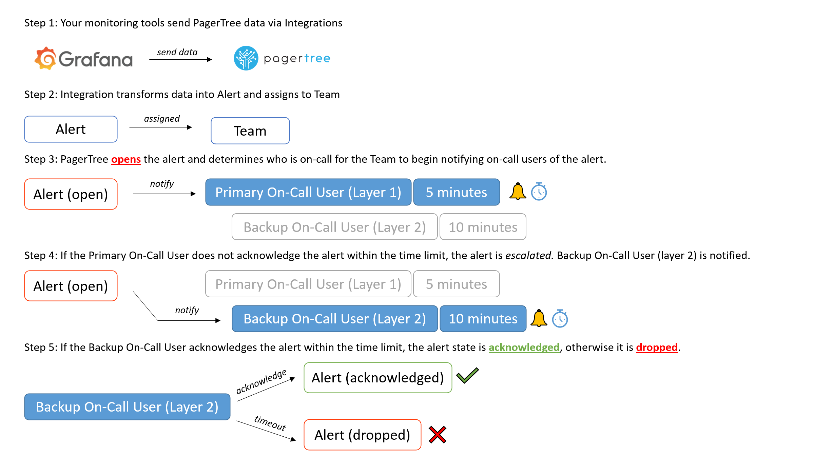
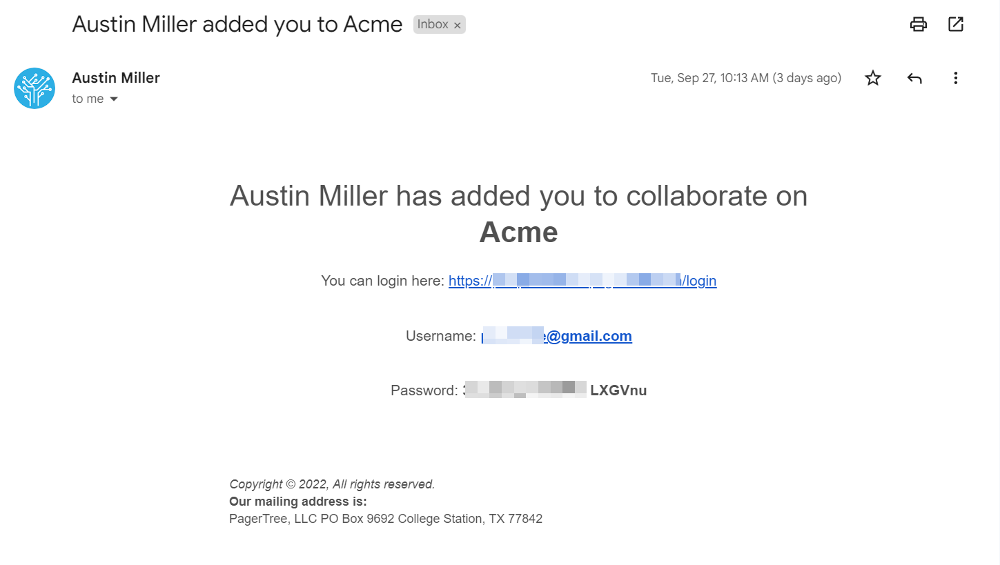

# Getting Started

## Quick Start Video

<iframe src="https://www.youtube-nocookie.com/embed/ffQJHPfRDhY" title="PagerTree Quick Start Video (v4)" class="rds-video"></iframe>

## Key Terms

PagerTree consists of several major objects:

* [**Users**](users.md) - Represent real people. They go on-call and receive notifications (push, email, SMS, voice, etc.).
* [**Teams**](teams.md) - Logically group together Users, Schedules, and Escalation Policies.
* [**Schedules**](schedules.md) - Determine who is on-call at any given moment.
* [**Escalation Policies**](escalation-policies.md) - Define on-call layers and timeouts.
* [**Alerts**](alerts.md) - Represent actionable issues that need user interaction.
* [**Integrations**](integrations.md) - Connectors to third-party tools.

## On-Call Schedule

Each Team has an on-call schedule and escalation policy.

| Item                            | Description                                                                                                                                                                                                                        |
| ------------------------------- | ---------------------------------------------------------------------------------------------------------------------------------------------------------------------------------------------------------------------------------- |
| On-Call Schedule (Top Left)     | Team's on-call schedule. [Team admins](teams.md#team-roles) can schedule users to be on-call for specific times and dates. Colors represent the [escalation layer](escalation-policies.md#escalation-layers) the event is tied to. |
| Escalation Policy (Top Right)   | Team's escalation policy. Determines how alert assigned to this team move through the current on-call schedule escalation layers.                                                                                                  |
| Current On-Call Roster (Bottom) | Show which user(s) are currently on-call for any given escalation layer.                                                                                                                                                           |

## Alert Escalation Process

1. Your monitoring tools send PagerTree data via [integrations](integrations.md).
2. Integration transforms data into an [alert](alerts.md) and assigns it to a [team](teams.md).
3. PagerTree [_opens_](alerts.md#alert-states) the alert and determines who is on-call for the team to begin [notifying](notifications.md) on-call users of the alert. The Primary On-Call User (Layer 1 is notified). PagerTree waits up to 5 minutes for a response.
4. If the Primary On-Call User does not [acknowledge](alerts.md#acknowledge) the alert within the time limit, the alert is _escalated_. Backup On-Call User (layer 2) is notified.
5. If the Backup On-Call User acknowledges the alert within the time limit, the [alert state](alerts.md#alert-states) is _acknowledged_, otherwise it is _dropped_.

## Users

### User Preferences

Each user has their own preferences. It is up to the user to elect how they want to be notified. This can be done on the [My Settings page](https://app.pagertree.com/user/settings).

### Inviting Users

Users can be added to your [account](architecture-guide.md).

1. Navigate to the [Users page](https://app.pagertree.com/users).
2.  Click the **New User** button in the top right corner.

    
3. Follow the instructions on the New User form:
   * _Name_ - Full Name _(Required)_
   * _Email_ - Work Email _(Required)_
   * _Roles_ - Roles this user should have in this PagerTree account.
   *   _Team_ - Team this user should be a member of.
    
4. Click **Create** button.

If successful, you should now be directed to the newly created user page. A notice at the top of the page will inform you either:

* _Created_ - The user was successfully created.
* _Invited_ - The user was successfully invited (this user is already part of another PagerTree account).

In each case, the created or invited user will receive an email with directions on how to login.

## Connect Your Tools

### Create an Integration

1. Navigate to the [Integrations page](https://app.pagertree.com/integrations).
2.  Click the **New Integration** button in the top right corner.
    
3.  Click the **integration logo** of the tool you are trying to integrate. If you do not see your tool select the email or webhook integration.
    
4. Follow the instructions on the New Integration form:
   * _Name_ - A memorable name for this integration _(Required)_.
   * _Urgency_ - An appropriate urgency for alerts coming through this integration _(Required)_.
   * _Destination_ - The team alerts should be assigned to for alerts created by this integration _(Required)_.
       
5. Click **Create**.

If successful, you should now be directed to the newly created integration page.

As the last steps you will need to:

1. Copy the endpoint.
2. Follow the [integration guide](/docs/integration-guides/introduction.md).
