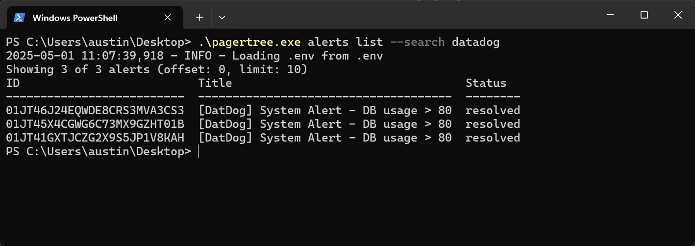

# PagerTree CLI: Command Line Interface

## Introduction

The [PagerTree CLI](https://github.com/PagerTree/pager_tree-cli) (`pagertree` or `pagertree.exe` ) is a command-line utility designed to interact with the PagerTree incident management platform. It enables users to create, acknowledge, and resolve alerts, as well as integrate PagerTree with other tools via shell scripts. The CLI communicates with [PagerTree's RESTful Web API](/docs/api/introduction.md), providing a flexible way to automate incident management tasks.



`pagertree` includes a built-in [help system](command-line-interface.md#help-system) to guide users through available commands and options. It is ideal for integrating PagerTree with monitoring tools, automating workflows, or performing administrative tasks from the command line.

This documentation provides instructions for installing, configuring, and using the PagerTree CLI. For the latest updates and source code, visit the [GitHub repository](https://github.com/PagerTree/pager_tree-cli).

## Installation

### Prerequisites

* **PagerTree Account**: You need a valid PagerTree account and an API key. Create an API Key in your [PagerTree user settings page](https://app.pagertree.com/user/settings) to obtain your API key.
* **Internet Access**: The CLI requires an internet connection to communicate with PagerTree's API. If your environment uses a proxy, configure proxy settings as described in the [Configuration section](command-line-interface.md#configuration).

### Installation Methods

* **Precompiled Binaries**: Download precompiled distributions from the [GitHub Releases page](https://github.com/PagerTree/pager_tree-cli/releases).
* **From Source**:
  * **Python**: The PagerTree CLI is built using Python. Ensure you have Python 3.8 or later installed. Download it from [python.org](https://www.python.org/downloads/).
  *   Clone the repository and install manually:

      ```bash
      git clone https://github.com/PagerTree/pager_tree-cli.git
      cd pager_tree-cli
      python -m venv venv
      source venv/bin/activate
      pip install -r requirements.txt
      python pagertree.py --help
      ```

## Configuration

The PagerTree CLI can use multiple methods for configuration:

1. An [environment variable file](command-line-interface.md#env) `.env`
2. [Environment variables](command-line-interface.md#environment-variables)

### .env

The CLI will look for a `.env` file in the current working directory. A `.env` file simply loads key value pairs into environment variables on application initialization.

```bash title=".env"
PAGERTREE_API_KEY=your_api_key_here
```

Alternatively, you can specify the `.env` file through the command flag.

```bash
pagertree -c ../some/other/path/.env alerts list
```

### Environment Variables

You can run the CLI with the environment variables directly set.

```bash title="Linux / MacOS"
export PAGERTREE_API_KEY=your_api_key_here
pagertree alerts list

# Alternatively, use the environment variable just for a single command
PAGERTREE_API_KEY=your_api_key_here pagertree alerts list
```

```powershell title="Windows PowerShell"
$env:PAGERTREE_API_KEY="your_api_key_here"
pagertree.exe alerts list
```

### Configuration Options

| Environment Variable | Description                                                                                                        | Required |
| -------------------- | ------------------------------------------------------------------------------------------------------------------ | -------- |
| `PAGERTREE_API_KEY`  | Your PagerTree API key, obtained from the [PagerTree user settings page](https://app.pagertree.com/user/settings). | Yes      |
| `PAGERTREE_BASE_URL` | The PagerTree API endpoint (default: `https://api.pagertree.com/api/v4`).                                          | No       |
| `PAGERTREE_VERBOSE`  | Enable verbose output.                                                                                             | No       |

## Commands

The PagerTree CLI offers a range of commands for interacting with PagerTree. Run `pagertree --help` to see the complete list of commands.

#### Common Commands

* `pagertree alerts list --status "open"`: List open alerts.
* `pagertree alerts create --title "Out of Memory" --alias "oom" --team-id "01JT13C98M186XA3QTRFC250MT`: Create a new alert with an alias.
* `pagertree teams list`: List all teams.
* `pagertree teams current-oncall "01JT13C98M186XA3QTRFC250MT"`: List current on-call users for a team.

## Help System

The CLI includes a contextual help system. Use the `--help` flag to explore commands and options:

*   List all commands:

    ```bash
    pagertree --help
    ```
*   Get help for a specific command:

    ```bash
    pagertree <command> --help
    ```

## Logging

Enable verbose output for debugging by adding the `--verbose` or `-v` flag:

```bash
pagertree --verbose alerts list 
```

## Troubleshooting

* **Command Not Found**: Ensure `pagertree` is installed and accessible in your `PATH`. Ensure you have typed the command correctly.
* **API Key Errors**: Verify that your API key is supplied and correct.
* **Connection Issues**: Check your internet connection or proxy settings (if applicable).

For additional support, file an issue on the [GitHub repository](https://github.com/PagerTree/pager_tree-cli) or contact PagerTree support at [support@pagertree.com](mailto:support@pagertree.com).
